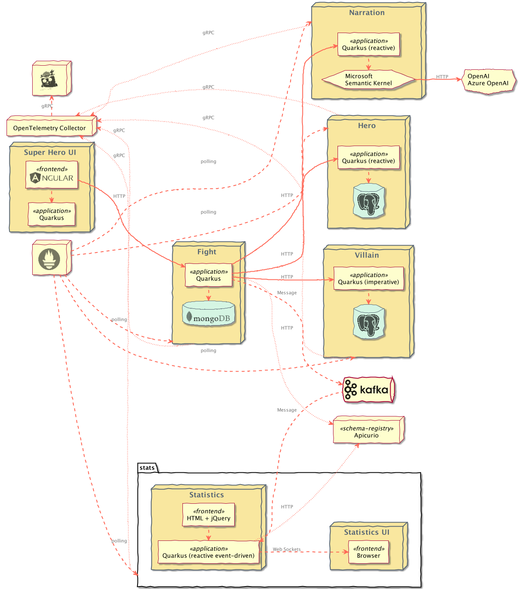

# Quarkus Superheroes Sample

## Table of Contents
- [Introduction](#introduction)
- [Running Locally via Docker Compose](#running-locally-via-docker-compose)

## Introduction

This is a sample application demonstrating Quarkus features and best practices. The application allows superheroes to fight against supervillains. The application consists of several microservices, communicating either synchronously via REST or asynchronously using Kafka:
- [Super Hero Battle UI](ui-super-heroes)
    - An Angular application to pick up a random superhero, a random supervillain, and makes them fight.
    - The Super Hero UI is exposed via Quarkus and invokes the Fight REST API.
- [Villain REST API](rest-villains)
    - A classical HTTP microservice exposing CRUD operations on Villains, stored in a PostgreSQL database.
    - Implemented with blocking endpoints using [RESTEasy Reactive](https://quarkus.io/guides/resteasy-reactive) and [Quarkus Hibernate ORM with Panache's active record pattern](https://quarkus.io/guides/hibernate-orm-panache).
- [Hero REST API](rest-heroes)
    - A reactive HTTP microservice exposing CRUD operations on Heroes, stored in a PostgreSQL database.
    - Implemented with reactive endpoints using [RESTEasy Reactive](https://quarkus.io/guides/resteasy-reactive) and [Quarkus Hibernate Reactive with Panache's repository pattern](http://quarkus.io/guides/hibernate-reactive-panache).
- [Fight REST API](rest-fights)
    - A REST API invoking the Hero and Villain APIs to get a random superhero and supervillain. Each fight is then stored in a PostgreSQL database.
    - Implemented with reactive endpoints using [RESTEasy Reactive](https://quarkus.io/guides/resteasy-reactive) and [Quarkus Hibernate Reactive with Panache's active record pattern](http://quarkus.io/guides/hibernate-reactive-panache).
    - Invocations to the Hero and Villain APIs are done using the [reactive rest client](https://quarkus.io/guides/rest-client-reactive) and are protected using [resilience patterns](https://quarkus.io/guides/smallrye-fault-tolerance), such as retry, timeout, and circuit breaking.
    - Each fight is asynchronously sent, via Kafka, to the Statistics microservice
- [Statistics](event-statistics)
    - Stores statistics about each fight and serves them to an HTML + JQuery UI using [WebSockets](https://quarkus.io/guides/websockets).
- Prometheus
    - Polls metrics from the Fight, Hero, and Villain microservices.

Here is an architecture diagram of the application:

The main UI allows you to pick one random Hero and Villain by clicking on _New Fighters_. Then, click _Fight!_ to start the battle. The table at the bottom shows the list of previous fights.

## Running Locally via Docker Compose
Pre-built images for all of the applications in the system can be found at [`quay.io/quarkus-super-heroes`](http://quay.io/quarkus-super-heroes).

First, start the required infrastructure by running (be sure to run from the root project directory) `docker-compose -f rest-fights/infrastructure/docker-compose.infra.yml -f rest-fights/infrastructure/docker-compose.infra.downstream.yml up --remove-orphans`.

Once that starts, then start one of the 4 versions of the application:

| Description                  | Image Tag              | Docker Compose Run Command                                                                                                                                                                                                                                                                                                                  |
|------------------------------|------------------------|---------------------------------------------------------------------------------------------------------------------------------------------------------------------------------------------------------------------------------------------------------------------------------------------------------------------------------------------|
| JVM Java 11                  | `java11-latest`        | `docker-compose -f rest-villains/infrastructure/docker-compose.app-jvm11.yml -f rest-heroes/infrastructure/docker-compose.app-jvm11.yml -f rest-fights/infrastructure/docker-compose.app-jvm11.yml -f event-statistics/infrastructure/docker-compose.app-jvm11.yml -f ui-super-heroes/infrastructure/docker-compose.app.yml up`             |
| JVM Java 17                  | `java17-latest`        | `docker-compose -f rest-villains/infrastructure/docker-compose.app-jvm17.yml -f rest-heroes/infrastructure/docker-compose.app-jvm17.yml -f rest-fights/infrastructure/docker-compose.app-jvm17.yml -f event-statistics/infrastructure/docker-compose.app-jvm17.yml -f ui-super-heroes/infrastructure/docker-compose.app.yml up`             |
| Native compiled with Java 11 | `native-java11-latest` | `docker-compose -f rest-villains/infrastructure/docker-compose.app-native11.yml -f rest-heroes/infrastructure/docker-compose.app-native11.yml -f rest-fights/infrastructure/docker-compose.app-native11.yml -f event-statistics/infrastructure/docker-compose.app-native11.yml -f ui-super-heroes/infrastructure/docker-compose.app.yml up` |
| Native compiled with Java 17 | `native-java17-latest` | `docker-compose -f rest-villains/infrastructure/docker-compose.app-native17.yml -f rest-heroes/infrastructure/docker-compose.app-native17.yml -f rest-fights/infrastructure/docker-compose.app-native17.yml -f event-statistics/infrastructure/docker-compose.app-native17.yml -f ui-super-heroes/infrastructure/docker-compose.app.yml up` |

There is a [`watch-services.sh`](scripts/watch-services.sh) script that can be run in a separate terminal that will watch the startup of all the services and report when they are all up.

Once started the main application will be exposed at `http://localhost:8080`. If you want to watch the [Event Statistics UI](event-statistics), that will be available at `http://localhost:8085`.

When finished, `CTRL-C` both of the terminals running `docker-compose`. If you are going to try out the different versions you can leave the infrastructure up while stopping and re-starting the applications. When complete it might be a good idea to run `docker-compose -f rest-fights/infrastructure/docker-compose.infra.yml -f rest-fights/infrastructure/docker-compose.infra.downstream.yml down --remove-orphans`.
