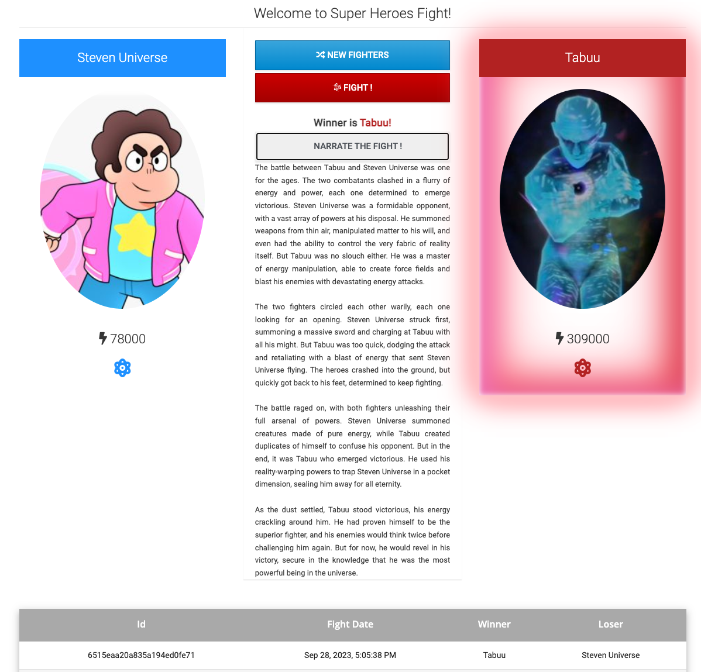

# Quarkus Superheroes Sample

This is a sample application demonstrating Quarkus features and best practices. The application allows superheroes to fight against supervillains. The application consists of several microservices, communicating either synchronously via REST or asynchronously using Kafka:
- Super Hero UI
    - An Angular application to pick up a random superhero, a random supervillain, and makes them fight.
    - The Super Hero UI is exposed via Quarkus and invokes the Fight REST API.
- Villain REST API
    - A classical HTTP microservice exposing CRUD operations on Villains, stored in a PostgreSQL database.
    - Implemented with blocking endpoints using [RESTEasy Reactive](https://quarkus.io/guides/resteasy-reactive) and [Quarkus Hibernate ORM with Panache](https://quarkus.io/guides/hibernate-orm-panache).
- Hero REST API
    - A reactive HTTP microservice exposing CRUD operations on Heroes, stored in a PostgreSQL database.
    - Implemented with reactive endpoints using [RESTEasy Reactive](https://quarkus.io/guides/resteasy-reactive) and [Quarkus Hibernate Reactive with Panache](http://quarkus.io/guides/hibernate-reactive-panache).
- Fight REST API
    - A REST API invoking the Hero and Villain APIs to get a random superhero and supervillain. Each fight is then stored in a PostgreSQL database.
    - Implemented with blocking endpoints using [RESTEasy Reactive](https://quarkus.io/guides/resteasy-reactive) and [Quarkus Hibernate ORM with Panache](https://quarkus.io/guides/hibernate-orm-panache).
    - Invocations to the Hero and Villain APIs are protected using [resilience patterns](https://quarkus.io/guides/smallrye-fault-tolerance), such as retry, timeout, and circuit breaking.
    - Each fight is asynchronously sent, via Kafka, to the Statistics microservice
- Statistics
    - Stores statistics about each fight and serves them to an HTML + JQuery UI using [WebSockets](https://quarkus.io/guides/websockets).
- Prometheus
    - Polls metrics from the Fight, Hero, and Villain microservices.

Here is an architecture diagram of the application:

The main UI allows you to pick one random Hero and Villain by clicking on _New Fighters_. Then, click _Fight!_ to start the battle. The table at the bottom shows the list of previous fights.

