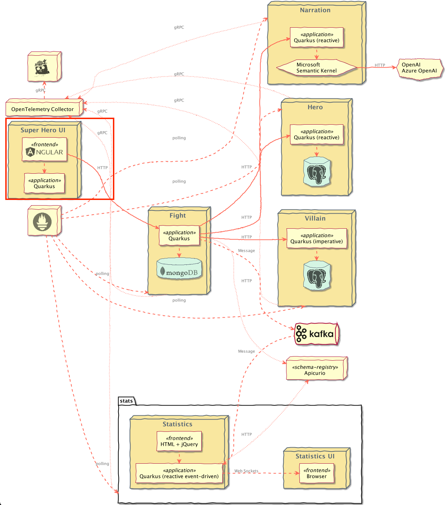

# Superheroes Battle UI

## Table of Contents
- [Introduction](#introduction)
- [Building the Application](#building-the-application)
- [Local Development](#local-development)
- [Running the Application](#running-the-application)
- [Running Locally via Docker Compose](#running-locally-via-docker-compose)
- [Deploying to Kubernetes](#deploying-to-kubernetes)
    - [Routing](#routing)

## Introduction
This is the main user interface for the application. The application is an Angular application served via Node.js.



The main UI allows you to pick up one random Hero and Villain by clicking on "New Fighters." Then it’s just a matter of clicking on "Fight!" to get them to fight. The table at the bottom shows the list of the previous fights.


## Building the Application
Environment variables can be injected into the build using the [ngx-env](https://github.com/chihab/ngx-env) plugin. Remember, these are pulled in at build time and are inserted as string literals in the resulting JS files.

Variables must start with the `NG_APP` prefix, e.g `NG_APP_MY_URL=http://localhost:1234`.

Production builds are served using a Node.js server. This server serves the compiled Angular application and an `env.js` file. This `env.js` file is generated at startup, and adds a `window.NG_CONFIG` property that the Angular application can read from.

Currently, the `env.js` will expose just the `API_BASE_URL` that's set at runtime. This will control the base URL to connect to the [fights](../rest-fights) service. The default if unset is http://localhost:8082.

You also need to make sure the angular CLI is installed (`npm install @angular/cli@12.2.8`).

```bash
npm run build
```

## Local Development
Use the following command:

```shell
npm run dev
```

This starts the Angular hot reloading server at http://localhost:4200, and the Node.js server to supply the `env.js` file. The Angular server on port 4200 will proxy the request for `env.js` to the Node.js server on port 8080.

The Node.js server port can be changed by setting the `HTTP_PORT` variable. The `ng.proxy.config.json` file will need to be updated with the new Node.js server port number if you deviate from 8080.

## Running the Application
1. First you need to start up all of the downstream services ([Heroes Service](../rest-heroes), [Villains Service](../rest-villains), and [Fights Service](../rest-fights)). 
    - The [Event Statistics Service](../event-statistics) is optional.
2. Follow the steps above section, *Building the Application*.
3. Set the `API_BASE_URL` environment variable with the appropriate [Fights Service](../rest-fights) hostname and port.
   > By default, the [`rest-fights`](../rest-fights) service runs on port `8082`.
4. Start the service using the command `npm start`.
    - You can also set the environment variable `CALCULATE_API_BASE_URL=true` to have it compute the base URL. Only use this option if the UI url is in the form of `ui-super-heroes.somewhere.com`. In this instance, setting `CALCULATE_API_BASE_URL=true` will replace `ui-super-heroes` in the URL with `rest-fights`.

There is also a container image available that you can use instead:

 ```bash
docker run -p 8080:8080 -e API_BASE_URL=http://localhost:8082 quay.io/quarkus-super-heroes/ui-super-heroes:latest
```

## Running Locally via Docker Compose
Pre-built images for this application can be found at [`quay.io/quarkus-super-heroes/ui-super-heroes`](https://quay.io/repository/quarkus-super-heroes/ui-super-heroes?tab=tags).

The application can be started outside of docker compose simply with `docker run -p 8080:8080 quay.io/quarkus-super-heroes/ui-super-heroes:latest`.

If you want to use docker compose, from the `quarkus-super-heroes/ui-super-heroes` directory run:

```bash
docker-compose -f deploy/docker-compose/app.yml up
```

If you want to stand up the entire system, [follow these instructions](../README.md#running-locally-via-docker-compose).

Once started the application will be exposed at `http://localhost:8080`.

## Deploying to Kubernetes
Pre-built images for this application can be found at [`quay.io/quarkus-super-heroes/ui-super-heroes`](https://quay.io/repository/quarkus-super-heroes/ui-super-heroes?tab=tags).

Deployment descriptors for this image are provided in the [`deploy/k8s`](deploy/k8s) directory. There is one for [OpenShift](https://www.openshift.com) ([`app-openshift.yml`](deploy/k8s/app-openshift.yml)), [Minikube](https://minikube.sigs.k8s.io) ([`app-minikube.yml`](deploy/k8s/app-minikube.yml)), and [Kubernetes](https://www.kubernetes.io) ([`app-kubernetes.yml`](deploy/k8s/app-kubernetes.yml)).

These are only the descriptors for this application and not the entire system. If you want to deploy the entire system, [follow these instructions](../README.md#deploying-to-kubernetes).

### Routing
There are 2 environment variables that can be set on this application to control how the Angular UI communicates with the [`rest-fights`](../rest-fights) application:

| Env Var                  | Default Value                                        | Description                                                                                                                                                                                                                                                                                                      |
|--------------------------|------------------------------------------------------|------------------------------------------------------------------------------------------------------------------------------------------------------------------------------------------------------------------------------------------------------------------------------------------------------------------|
| `API_BASE_URL`           | `undefined`                                          | The base URL for the [`rest-fights`](../rest-fights) application.  Set this to a fully qualified URL (i.e. http://www.example.com or http://somehost.com:someport) to define the URL for the [`rest-fights`](../rest-fights) application.                                                                        |
| `CALCULATE_API_BASE_URL` | `false` on Minikube/Kubernetes. `true` on OpenShift. | If `true`, look at the URL in the browser and replace the `ui-super-heroes` host name with `rest-fights`. This is because on OpenShift, each application has its own `Route` which exposes a unique hostname within the cluster. On Minikube and Kubernetes, an `Ingress` using different paths is used instead. |
